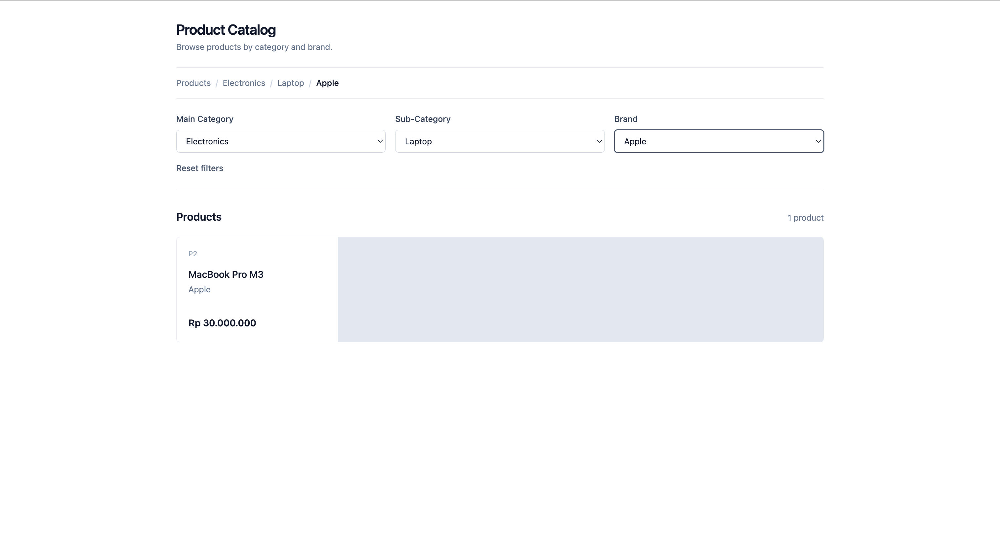

# Product Catalog with Cascading Filters

A responsive product catalog built for the RevoU Code Challenge. Users can filter products through dependent category, sub-category, and brand selections.

## Features

- Cascading category, sub-category, and brand filters
- Disabled dependent filters until the required parent is selected
- Product results updated according to the selected filters
- URL search parameters used as the filter state
- Filter state preserved after refresh
- Browser Back and Forward navigation support
- Invalid filter combinations automatically removed from the URL
- Dynamic breadcrumb based on the active filters
- Responsive layout for desktop and mobile screens

## Tech Stack

- React
- TypeScript
- Vite
- React Router DOM Data API
- Tailwind CSS

## Preview



## How the Filters Work

1. Select a **Main Category** to enable the Sub-Category filter.
2. Select a **Sub-Category** to enable the Brand filter.
3. Select a **Brand** to display products from that brand.
4. Changing a parent filter clears its dependent filters.

The selected state is stored in the URL:

```text
/?category=C1&subcategory=S1&brand=B2
```

This allows the filter state to remain consistent after refreshing the page or using browser navigation.

## Getting Started

After cloning the repository, install the dependencies:

```bash
npm install
```

Start the development server:

```bash
npm run dev
```

Open the local URL displayed in the terminal.

## Verification

Run ESLint:

```bash
npm run lint
```

Create a production build:

```bash
npm run build
```

## Project Structure

```text
src/
├── data/
│   └── catalog.ts
├── loaders/
│   └── catalog-loader.ts
├── types/
│   └── catalog.ts
├── App.tsx
├── main.tsx
└── router.tsx
```